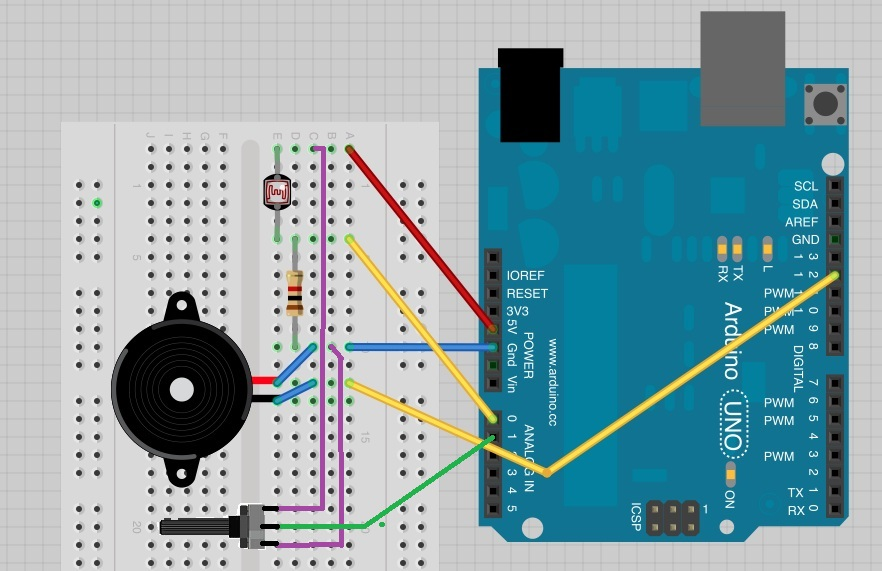
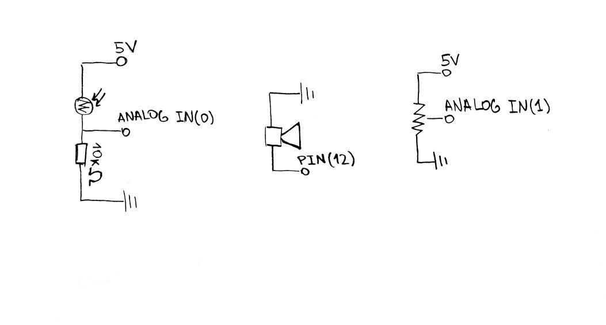
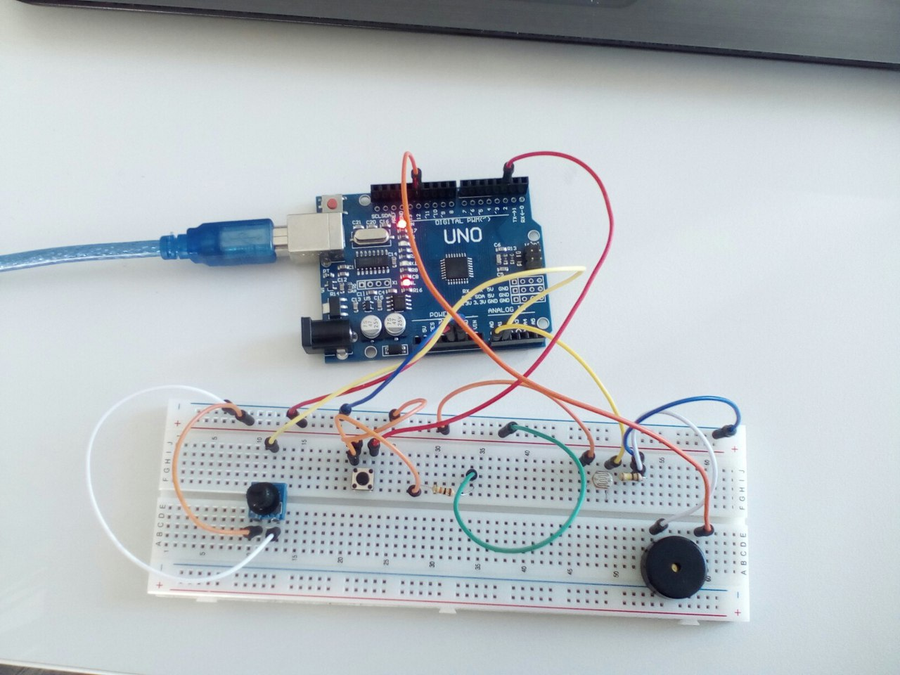

# Описание
Проект будет представлять из себя подобие примитивного музыкального инструмента, который будет издавать звуки разной высоты, в зависимости от положения руки относительно устройства. Предположительно, будут поддерживаться 3 режима звукоизвлечения: безтональный, тональный (с делением высоты звука на ноты) и ритмический (тональный с добавлением ритмических ударов).

Звук будет издаваться с помощью пьезо-динамика (Buzzer), высоту звука будет определять уровень на датчике освещенности (LDR). Таким образом, чем ближе рука будет находиться к датчику, тем меньше света будет на него попадать --- и наоборот. Этот эффект позволит получать звуки разной высоты.

Как дополнитульную функцию в ритмическом режиме, впоследствии планируется добавить крутилку (Potentiometer), настаривающую темп ритмических ударов.

# Требуемое оборудование
* Контроллер Arduino UNO
* [Пьезо-динамик](http://files.amperka.ru/datasheets/hpa17a.pdf)
* [Датчик освещенности](https://www.arduino.cc/documents/datasheets/LDR-VT90N2.pdf)
* [Потенциометр](https://www.arduino.cc/documents/datasheets/ACP_potentiometers.pdf)

# Средства разработки
В качестве основного средства разработки планируется использовать Arduino IDE.

# Cхема

(частично взято с [Pseudo-Thermin](https://learn.adafruit.com/adafruit-arduino-lesson-10-making-sounds/pseudo-theramin))

## Электрическая схема

## Готовая сборка
